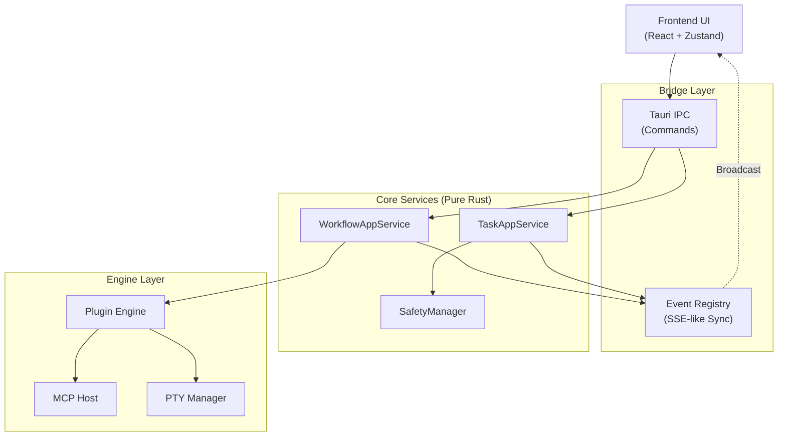

# Maestro Architecture Description

**Version**: 1.0 | **Last Updated**: 2026-04-09
**Status**: Active

## 1. 架构概览 (Overview)

Maestro 采用分层解耦的架构设计，确保核心逻辑在无 UI 环境下的稳定运行。

## 2. 层级说明 (Layers)

### 2.1 UI Layer
*   **技术栈**: React, Vite, Zustand.
*   **职责**: 提供直观的任务交互、消息追溯和引擎状态展示。
*   **约束**: 不允许直接处理数据库，必须通过 IPC 调用 Core 层。

### 2.2 Bridge Layer
*   **职责**: 处理上层指令下发（IPC）和下层状态回传（Events）。
*   **核心组件**: `src-tauri/src/agent_state/registry.rs`。

### 2.3 Core Services
*   **职责**: 处理复杂的业务逻辑、状态机转换和数据持久化。
*   **核心模块**:
    *   `src-tauri/src/workflow/`: 工作流引擎。
        *   `run.rs`: 核心调度逻辑。
        *   `step_executor.rs`: 单步执行器，支持 Headless 和 PTY 回退模式，内置 `VecDeque` 环形缓冲区优化 IO。
        *   `verification_parser.rs`: 基于正则的输出解析（预编译 `Lazy` 缓存）。
    *   `src-tauri/src/core/`: 门面层（Facade），如 `MaestroCore`。
    *   `src-tauri/src/task/`: 任务与并发管理。`TaskQueue` 负责精细化的并发控制。
*   **约束**: 必须实现 `AppEventHandle` 调用，禁止持有 Tauri 全局状态。

### 2.4 Engine Layer
*   **职责**: 具体执行 AI 代理指令、管理 PTY 会话、对接 MCP 协议。
*   **性能优化**: 集成 `tiktoken-rs` (cl100k_base) 实现精准的 Token 估算与监控。

## 3. 核心机制 (Core Mechanisms)

### 3.1 状态更新 (The Event Loop)
状态更新遵循单一流向：
1.  **Core** 层触发逻辑变更。
2.  通过 `EventRegistry` 广播。
3.  **TauriEventHandle** 推送到前端，或由 CLI 模块捕获。

### 3.2 并发与执行 (Concurrency)
所有任务通过 `TaskQueue` 调度，确保系统资源消耗可控（`max_concurrent_tasks`）。

## 4. 关键设计决策 (Key Design Decisions)

### 4.1 状态令牌卫士 (State Token Guard)
为了解决异步事件流中的“状态振荡”和过期数据覆盖问题：
1. **周期 ID**: 每次任务启动生成唯一的 `state_token`。
2. **端到端传播**: 后端在每个状态更新事件中包含该令牌。
3. **前端过滤**: 前端 `AgentStateReducer` 检查令牌，非当前周期的过期事件将被静默丢弃。

### 4.2 安全管理器 (SafetyManager)
为敏感操作提供非阻塞审批门锁：
- **异步响应**: 使用 `oneshot` 通道实现请求与审批的解耦。
- **UI 连通性保护**: 当无活跃前端会话时，自动拒绝高危请求。
- **清理机制 (Reaper)**: 定时清理超过 300 秒未响应的悬挂请求。

---
*Reference: Architectural Decision Records Consolidated.*
