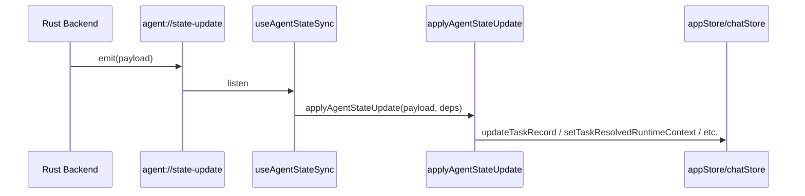
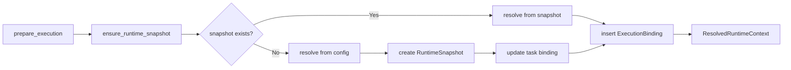

# Maestro 架构说明

## 核心数据流

## 任务状态分层

| 层级 | 类型 | 说明 |
|------|------|------|
| 1 | TaskRecord | 持久化实体：id, title, engine_id, profile_id, current_state 等 |
| 2 | TaskRuntimeBinding | 运行时绑定：engine_id, profile_id, runtime_snapshot_id, sessionId |
| 3 | ResolvedRuntimeContext | 可执行上下文：command, args, env, model 等实际执行参数 |

**建议**：组件优先使用 selectors/hooks，避免直接消费完整的 AppTask。

## 事件同步流

## 执行准备流程

## 状态管理边界

| 方案 | 职责 | 使用场景 |
|------|------|----------|
| **Zustand** | 应用全局状态 | engines、tasks、activeTaskId、UI 状态（theme、sidebar 等） |
| **后端 task_transition** | 任务生命周期 | BACKLOG -> PLANNING -> IN_PROGRESS -> CODE_REVIEW -> DONE，由 invoke 调用 |

**关系**：Zustand 通过 `useAgentStateSync` 接收后端 `agent://state-update` 事件更新；任务状态流转由后端 `task_transition` 驱动。

## 关键模块

- **task_repository**: 任务 CRUD、DB schema
- **task_runtime**: 运行时解析（snapshot / config）
- **execution_binding**: 执行准备、snapshot 创建
- **agent_state**: 事件定义与发送
- **task_migration**: 一次性迁移（如 profile_id 回填）

## 路径管理：全局 vs 工作区

| 用途 | 路径类型 | 路径示例 | 模块 |
|------|----------|----------|------|
| 任务 DB | 全局 | `{app_data_dir}/maestro_state.db` | task_state |
| 配置文件 | 全局 | `~/.maestro/config.toml` | config |
| 上次对话 | 全局 | `{app_config_dir}/last-conversation.json` | workflow/chat |
| Run records | 工作区 | `{project_path}/.maestro-cli/run-records.jsonl` | run_persistence |
| 会话日志 | 工作区 | `{project_path}/.maestro-cli/logs/{session_id}.log` | cli_state |
| 执行 cwd | 工作区 | `config.project.path` | execution |

**全局路径**：应用级数据，与具体项目无关，通常位于 `~/.maestro` 或 Tauri `app_data_dir`。

**工作区路径**：项目级数据，基于 `config.project.path`，通过 `WorkspaceIo` 解析。多项目场景下互不干扰。

## 状态分层简化评估 (4.1)

**现状**：三层状态（TaskViewState + TaskRuntimeBinding + ResolvedRuntimeContext）已实现关注点分离。

**建议**：
- 保持三层结构，不合并为两层，以避免破坏现有的事件驱动同步逻辑。
- 组件应优先使用 `useTaskRuntimeContext` 和 `useActiveTask`，避免直接消费 `AppTask`。
- 若需按 taskId 获取 resolved context，可扩展 `useTaskRuntimeContext` 或新增 `useTaskResolvedContext(taskId)` selector。
