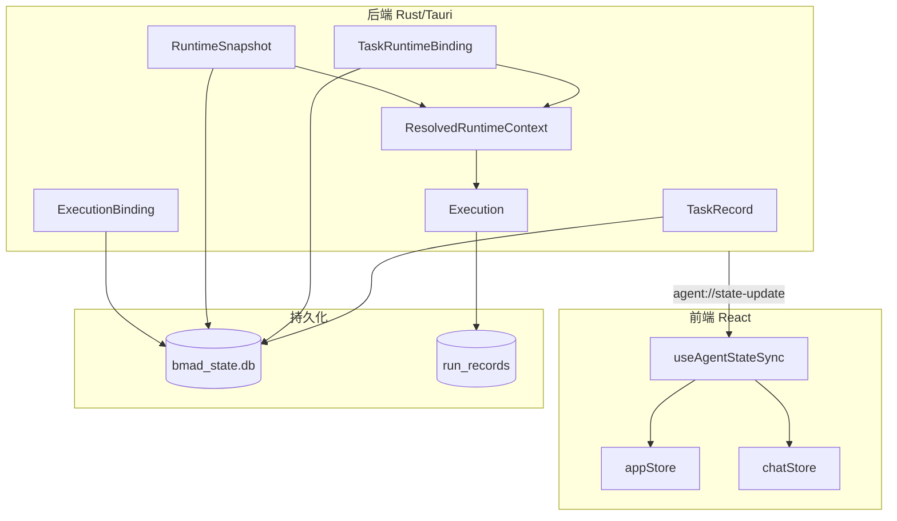
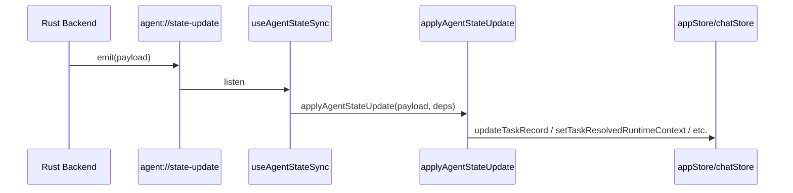
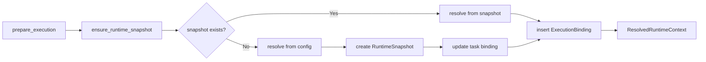

# Maestro 架构说明

## 核心数据流

## 任务状态分层

| 层级 | 类型 | 说明 |
|------|------|------|
| 1 | TaskRecord | 持久化实体：id, title, engine_id, profile_id, current_state 等 |
| 2 | TaskRuntimeBinding | 运行时绑定：engine_id, profile_id, runtime_snapshot_id, sessionId |
| 3 | ResolvedRuntimeContext | 可执行上下文：command, args, env, model 等实际执行参数 |

**建议**：组件优先使用 selectors/hooks，避免直接消费完整的 AppTask。

## 事件同步流

## 执行准备流程

## 关键模块

- **task_repository**: 任务 CRUD、DB schema
- **task_runtime**: 运行时解析（snapshot / config）
- **execution_binding**: 执行准备、snapshot 创建
- **agent_state**: 事件定义与发送
- **task_migration**: 一次性迁移（如 profile_id 回填）

## 状态分层简化评估 (4.1)

**现状**：三层状态（TaskViewState + TaskRuntimeBinding + ResolvedRuntimeContext）已实现关注点分离。

**建议**：
- 保持三层结构，不合并为两层，以避免破坏现有的事件驱动同步逻辑。
- 组件应优先使用 `useTaskRuntimeContext` 和 `useActiveTask`，避免直接消费 `AppTask`。
- 若需按 taskId 获取 resolved context，可扩展 `useTaskRuntimeContext` 或新增 `useTaskResolvedContext(taskId)` selector。
